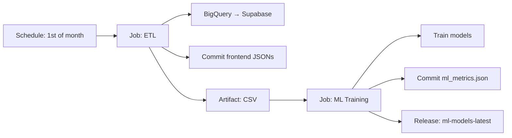

# Despliegue — London Crime Data Platform

## Arquitectura de Despliegue

```
[GitHub] ──push──→ [GitHub Actions]
                        │
                        ├── ci-backend.yml: black + flake8 + pytest
                        │   (push/PR a main)
                        │
                        ├── etl-pipeline.yml: ETL + ML automático
                        │   (1ro de cada mes + manual)
                        │   ┌────────────────────────────────────┐
                        │   │ Job etl:                            │
                        │   │   BigQuery → Clean → Supabase       │
                        │   │   → frontend JSONs → commit         │
                        │   │   └── CSV artifact                  │
                        │   │ Job ml-training (dep de etl):       │
                        │   │   CSV artifact → train ML           │
                        │   │   → commit métricas                 │
                        │   │   └── release ml-models-latest      │
                        │   └────────────────────────────────────┘
                        │
                        └── ml-training.yml: retrain standalone
                            (cada 3 días + manual)
                              → train → commit métricas
                              → release ml-models-latest
                        │
                        ▼
                  [Vercel] auto-deploy desde main
                  [Render] auto-deploy desde main
                        │
                        ▼
                  Render build: Dockerfile descarga .joblib
                  de release ml-models-latest (fallback a train)
```

| Componente | Plataforma | Config real |
|---|---|---|
| Frontend (React) | Vercel | `apps/frontend`, `npm run build` → `dist/` |
| Backend ML API | Render | `render.yaml` + Dockerfile raíz |
| Base de Datos | Supabase | tabla `london_crime_aggregated` |

Vercel y Render detectan cambios en `main` mediante sus integraciones nativas. Los workflows `etl-pipeline.yml` y `ml-training.yml` corren previo al deploy para asegurar datos frescos en Supabase y modelos actualizados en el release.

---

## Frontend — Vercel

### Configuración
- **Root directory:** `apps/frontend/`
- **Build command:** `npm run build`
- **Output directory:** `dist/`
- **Node version:** 18.x

### Variables de Entorno (Vercel dashboard)
```
VITE_SUPABASE_URL=https://xxxx.supabase.co
VITE_SUPABASE_ANON_KEY=eyJxxx
VITE_ML_API_URL=https://london-crime-api.onrender.com
```

### Despliegue manual
```bash
cd apps/frontend
npx vercel --prod
```

---

## Backend ML API — Render

### Configuración
- **Config:** `render.yaml`
- **Type:** Web Service
- **Runtime:** Docker (`env: docker`)
- **Dockerfile:** `Dockerfile` en la raíz
- **Start command real:** `uvicorn apps.backend.api.predict:app --host 0.0.0.0 --port 8000`

### Variables de Entorno (Render dashboard)
```
PORT=8000
```

### Health Check
Render usa `GET /health` desde `render.yaml`:
```json
{"status": "ok"}
```

---

## Base de Datos — Supabase

### Tabla: `london_crime_aggregated`
```sql
CREATE TABLE london_crime_aggregated (
  id SERIAL PRIMARY KEY,
  borough VARCHAR(100),
  major_category VARCHAR(100),
  minor_category VARCHAR(100),
  year INTEGER,
  month INTEGER,
  total_crimes INTEGER,
  date DATE
);

CREATE INDEX idx_london_crime_aggregated_borough ON london_crime_aggregated(borough);
CREATE INDEX idx_london_crime_aggregated_year ON london_crime_aggregated(year);
```

Los datos se cargan mediante el pipeline ETL con upsert. El dataset completo tiene ~23,000 registros agregados.

---

## CI/CD — GitHub Actions

El repositorio tiene **tres workflows**:

| Workflow | Archivo | Trigger | Permisos |
|----------|---------|---------|----------|
| CI Backend | `ci-backend.yml` | push/PR a main | read |
| ETL Pipeline | `etl-pipeline.yml` | 1ro de cada mes + manual | contents: write |
| ML Training | `ml-training.yml` | cada 3 días + manual | contents: write |

### `ci-backend.yml` — lint + tests
```yaml
name: CI Backend
on:
  push: {branches: [main, master]}
  pull_request: {branches: [main, master]}
jobs:
  test-lint-backend:
    runs-on: ubuntu-latest
    steps:
      - uses: actions/checkout@v4
      - uses: actions/setup-python@v5
        with: {python-version: '3.11'}
      - run: pip install 'black>=25.0,<26' flake8 -r requirements.txt
      - run: black --check apps/backend/
      - run: flake8 apps/backend/ --max-line-length=100 --exclude=.venv,__pycache__
      - run: python -m pytest apps/backend/tests/ -v
        env:
          SUPABASE_DB_URL: dummy
          GOOGLE_APPLICATION_CREDENTIALS: dummy
```

> El CI solo cubre backend. No hay workflow de frontend — Vercel hace su propio build al desplegar.

### `etl-pipeline.yml` — ETL + ML automático

```yaml
on:
  schedule: [{cron: '0 6 1 * *'}]   # 1ro de mes
  workflow_dispatch:                  # manual
```

**Job 1 — `etl`:** Corre `pipeline_dataops.py --production` con credenciales GCP (secret `GCP_SERVICE_ACCOUNT_JSON`) y `SUPABASE_DB_URL`. Genera `pipeline_logs.json` + `pipeline_stats.json`, los commitea, y sube el CSV procesado como artifact.

**Job 2 — `ml-training`** (depende de `etl`): Descarga el artifact del job anterior (datos frescos), corre `ml_pipeline.py`, commitea `ml_metrics.json`, y sube los `.joblib` al release `ml-models-latest` (se sobreescribe cada ejecución vía `ncipollo/release-action` con `allowUpdates`).



### `ml-training.yml` — standalone retrain

```yaml
on:
  schedule: [{cron: '0 6 3 * *'}]   # cada 3 días
  workflow_dispatch:
```

Mismo proceso que el job ML de `etl-pipeline.yml` pero independiente: usa el CSV ya commiteado en el repo (sin extraer de BigQuery). Commitea métricas y sube modelos al mismo tag `ml-models-latest`.

### Secrets requeridos en GitHub

| Secret | Uso | Dónde se necesita |
|--------|-----|-------------------|
| `GCP_SERVICE_ACCOUNT_JSON` | Service account JSON para BigQuery | `etl-pipeline.yml` (job etl) |
| `SUPABASE_DB_URL` | Conexión PostgreSQL a Supabase | `etl-pipeline.yml` (job etl) |

Los tests de `ci-backend.yml` usan valores dummy y no requieren secrets reales.

---

## Pipeline ETL

El pipeline ETL se ejecuta **automáticamente** cada 1ro de mes via GitHub Actions (`etl-pipeline.yml`), o **localmente** para desarrollo:

```bash
# ETL completo (BigQuery → limpia → Supabase)
python -m apps.backend.cli.pipeline_dataops

# Modo demo (datos sintéticos, sin BigQuery)
python -m apps.backend.cli.pipeline_dataops --demo

# Solo ML (entrenar modelos desde data/processed/london_crime_aggregated.csv)
python -m apps.backend.cli.ml_pipeline
```

### Requisitos del pipeline ETL
1. Credenciales GCP (`google-cloud-bigquery`) — archivo JSON de service account (solo para modo no-demo).
2. Credenciales Supabase — variable `SUPABASE_DB_URL`.
3. Dataset público `bigquery-public-data.london_crime.crime_by_lsoa` en BigQuery.

> En GitHub Actions, las credenciales se pasan via secrets: `GCP_SERVICE_ACCOUNT_JSON` y `SUPABASE_DB_URL`.

### Flujo ETL (detalle por módulo)
```
apps/backend/pipeline/ingestion.py
    BigQuery → ~3M filas LSOA
        │
        ▼
apps/backend/pipeline/cleaning.py  (clean_and_transform_data)
    ├── standardize_column_names()   → snake_case
    ├── handle_null_values()         → elimina filas con nulos críticos
    ├── validate_data_types()        → int64, float64, string
    ├── validate_value_ranges()      → meses 1-12, años 2008-2016
    ├── normalize_text_fields()      → title case, corrige boroughs
    ├── detect_and_remove_duplicates() → exactos + subset
    ├── create_date_column()         → year+month → date
    └── detect_outliers()            → IQR (solo reporta, no elimina)
        │
        ▼
apps/backend/pipeline/loading.py
    ├── save_clean_data()            → CSV + Parquet local
    └── load_to_supabase()           → upsert a Supabase
        │
        ▼
apps/backend/cli/ml_pipeline.py
    ├── apps/backend/ml/preprocessing.py  → features + preprocessor
    ├── apps/backend/ml/classification.py → LogisticRegression + RandomForestRegressor
    └── data/models/*.joblib              → modelos serializados
```

> El entrenamiento ML también corre automáticamente después de cada ETL (mismo workflow) y standalone cada 3 días. Los modelos se suben al release `ml-models-latest`.

## Docker / Compose

El proyecto sí incluye contenedores, pero están centralizados:

| Archivo | Uso |
|---|---|
| `Dockerfile` | Imagen de producción para Render: descarga modelos pre-entrenados de release `ml-models-latest` (fallback a entrenamiento en build), levanta FastAPI |
| `infra/docker-compose.yml` | Entorno local con backend + frontend |
| `infra/backend.Dockerfile` | Backend dev interactivo |
| `infra/frontend.Dockerfile` | Build React + nginx |
| `infra/nginx.conf` | SPA fallback + gzip + headers básicos |

```bash
docker compose -f infra/docker-compose.yml up --build
```
